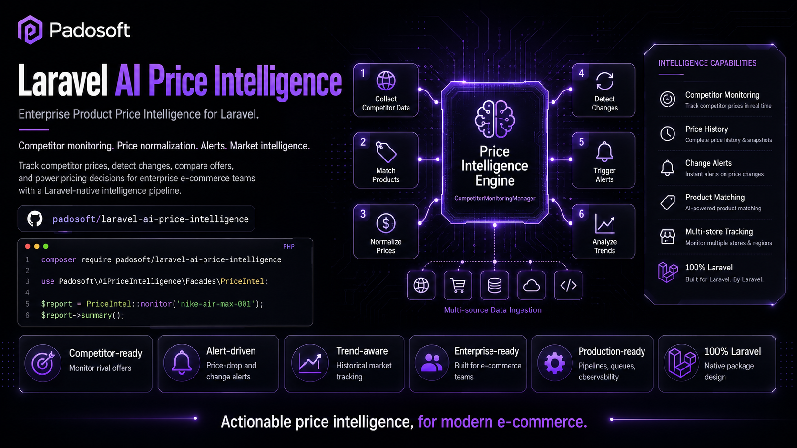
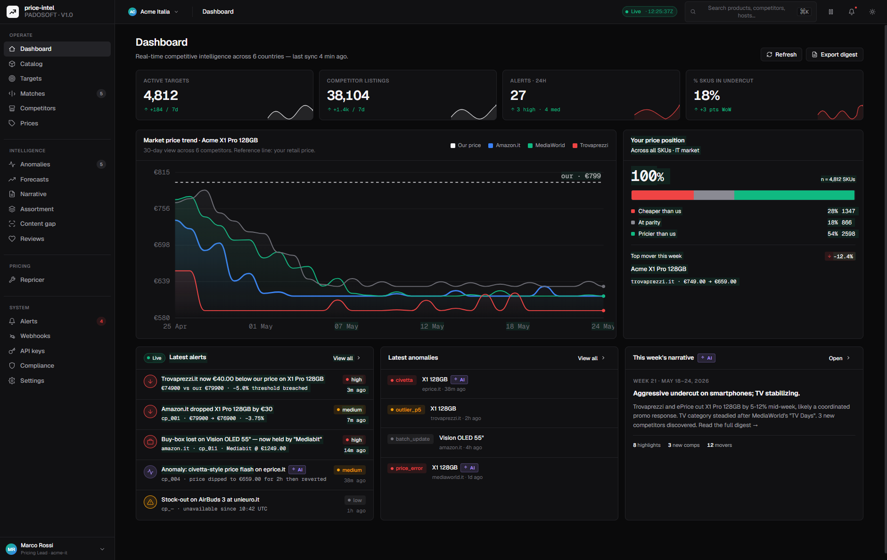

# laravel-ai-price-intelligence

[](https://packagist.org/packages/padosoft/laravel-ai-price-intelligence)
[](https://www.php.net/)
[](https://laravel.com/)
[](https://github.com/padosoft/laravel-ai-price-intelligence/actions/workflows/ci.yml)
[](LICENSE)



> **Enterprise Product & Price Intelligence / Competitor Monitoring for Laravel.** Open-source,
> AI-native and **EU AI Act-ready by design** — a self-hostable alternative to Netrivals (Lengow)
> and Competitoor. It is the *intelligence engine*; your ecommerce (MarginOS or your own logic)
> keeps the pricing decisions.

---

## Table of Contents

- [Why this package](#why-this-package)
- [Features](#features)
- [Web admin panel](#web-admin-panel)
- [Quick start](#quick-start)
- [Integrating with your ecommerce](#integrating-with-your-ecommerce)
- [Architecture](#architecture)
- [AI features](#ai-features)
- [Compliance: GDPR & EU AI Act](#compliance-gdpr--eu-ai-act)
- [Configuration & feature toggles](#configuration--feature-toggles)
- [Competitive matrix](#competitive-matrix)
- [Extending](#extending)
- [Testing](#testing)
- [Documentation](#documentation)
- [License](#license)

---

## Why this package

Ecommerce teams pay expensive, black-box SaaS (Netrivals, Competitoor) to monitor competitor prices,
assortments and content. `laravel-ai-price-intelligence` brings that capability **into your Laravel
stack**, open-source and self-hostable:

- You send the **SKUs**, the **countries** to watch, and either the **competitor URLs** or let the
  **AI search** discover them.
- The package **matches** the right competitor product (GTIN → MPN → name → embedding → optional
  vision LLM), **scrapes** price/stock/content, **normalizes** prices (multi-currency FX), stores
  **time-series**, runs **AI** (forecast, anomaly, sentiment) and emits **signed webhooks + events**.
- Your ecommerce reads those signals for **dynamic pricing**, **MAP enforcement**, **assortment** and
  **merchandising** — the package never applies prices for you (advisory by design).

It is **boundary-respecting**: it provides intelligence; your platform keeps the business decisions.

## Features

- 🔌 **Catalog onboarding**: bulk JSON, CSV import, webhook sync, console command.
- 🌍 **Geo-aware discovery** via [`padosoft/laravel-ai-search-providers`](https://github.com/padosoft/laravel-ai-search-providers) (per-target country/locale).
- 🧠 **Cascade product matching** with confidence band + human-review queue (auto ≥85 / review 60–85 / reject <60).
- 🕷️ **Scraping**: JSON-LD + OpenGraph extraction, generic HTTP + Browsershot, **marketplace adapters**
  (Amazon, eBay, Google Shopping, Idealo, Trovaprezzi).
- 💶 **Price normalization**: multi-currency FX to a base currency, time-series observations.
- ⏱️ **Scheduling** with adaptive backoff + per-tenant Horizon queues.
- 🚨 **Alerts + HMAC-signed webhooks**: price drop/raise, undercut, stock-out.
- 🤖 **AI layer**: forecasting, anomaly detection, GDPR-safe review sentiment (pluggable, toggleable).
- 💸 **Optional no-code repricer** (off by default, advisory-only).
- 🛡️ **Compliance**: robots.txt policy, gentleman rate-limiting, PII redaction, **EU AI Act** disclosure + bridge.
- 🏢 **Multi-tenant** (single-DB or database-per-tenant), Sanctum + API-key auth with scopes.

## Web admin panel

A companion **web admin panel** ships separately at
[`padosoft/laravel-ai-price-intelligence-admin`](https://github.com/padosoft/laravel-ai-price-intelligence-admin)
(React 19 + Vite + TypeScript + Tailwind) — the control room Netrivals/Competitoor don't give you
self-hosted: dashboards, the match-review queue, price-history charts, forecasts & anomalies, the
weekly AI narrative, assortment/content gaps, the repricer rule builder, alerts inbox, webhooks and
an EU AI Act compliance view.



## Quick start

```bash
composer require padosoft/laravel-ai-price-intelligence
php artisan vendor:publish --tag=price-intelligence-config   # optional
php artisan migrate
```

Issue an API key for machine-to-machine access:

```php
use Padosoft\PriceIntelligence\Models\ApiKey;

[$key, $plaintext] = ApiKey::issue($tenantId, 'ecommerce-sync', ['*']);
// store $plaintext securely — it is shown only once
```

## Integrating with your ecommerce

```php
// 1. Sync the catalog (bulk, idempotent on external_id)
Http::withHeaders(['X-Api-Key' => $key])->post("$base/api/v1/catalog/products:bulk", [
    'products' => [[
        'external_id' => 'SKU-123', 'gtin' => '8001234567890',
        'brand' => 'Acme', 'model' => 'X1', 'name' => 'Acme X1 64GB',
        'categories' => ['Electronics', 'Phones'], 'our_price_cents' => 19900,
        'currency' => 'EUR', 'base_country' => 'IT',
    ]],
]);

// 2. Create a monitoring target (per product × country)
Http::withHeaders(['X-Api-Key' => $key])->post("$base/api/v1/targets", [
    'product_external_id' => 'SKU-123', 'country' => 'IT', 'frequency' => 'daily',
    // 'given_urls' => ['https://www.amazon.it/dp/B0...'],  // skip AI discovery
]);

// 3. React to signals (signed webhook listener in your app)
use Padosoft\PriceIntelligence\Services\Webhooks\WebhookSigner;

Route::post('/webhooks/price-intel', function (Request $r) {
    abort_unless(WebhookSigner::verify(
        $r->getContent(), config('services.pi.secret'), $r->header(WebhookSigner::HEADER, '')
    ), 401);

    match ($r->input('event')) {
        'price.dropped', 'undercut.detected' => MarginOS::reevaluate($r->input('data')),
        default => null,
    };
});
```

See [`docs/INTEGRATION-GUIDE.md`](docs/INTEGRATION-GUIDE.md) for the full API and event reference.

## Architecture

Ecommerce → API (Sanctum/API-key) → discovery → matching → scheduled scraping (adapters) →
price normalization → time-series storage → AI layer → alerts + signed webhooks → your ecommerce.

Everything is **pluggable via Interface + Driver**; optional dependencies are wired with the
null-object pattern (no hard requirement). Full design in [`docs/PROJECT.md`](docs/PROJECT.md).

## AI features

| Feature | Default | Notes |
|---|---|---|
| Price forecasting | on | `StatisticalForecaster` (OLS trend + confidence interval), pluggable |
| Anomaly detection | on | detrended-residual outliers + price-error (civetta) detection |
| Review sentiment | **off** | GDPR-safe: per-domain opt-in, mandatory PII redaction, anonymous aggregates only |
| Visual / content-gap / narrative / assortment / promo | interface-ready | LLM-driven, host-bindable drivers |

Every AI output is flagged `is_ai_generated` and logged in `ai_decision_logs`.

## Compliance: GDPR & EU AI Act

- **robots.txt** respected per-domain (opt-out is explicit + audited); gentleman per-domain rate-limit.
- **PII redaction** on scraped content via [`padosoft/laravel-pii-redactor`](https://github.com/padosoft/laravel-pii-redactor) when installed.
- **EU AI Act**: native disclosure (`is_ai_generated`, decision log, human-in-the-loop matching) plus
  an optional bridge to [`padosoft/laravel-ai-act-compliance`](https://github.com/padosoft/laravel-ai-act-compliance).
- Audit `fetch_logs` with a retention prune command (`piprice:audit:prune`).

## Configuration & feature toggles

Every feature and resilience mitigation has an explicit switch in `config/price-intelligence.php`
(`ai.*.enabled`, `review_insight.enabled`, `repricer.enabled`, `discovery.*`, `scraping.*`,
`marketplaces.*`, `matching.*`, `storage.*`, `compliance.*`, `ai_act.*`). Nothing runs that you
didn't enable.

## Competitive matrix

| Capability | Netrivals | Competitoor | **this package** |
|---|:-:|:-:|:-:|
| Price/stock multi-country | ✅ | ✅ | ✅ |
| AI product matching | ✅ | ⚠️ | ✅ cascade + confidence |
| Visual matching (vision LLM) | ❌ | ❌ | ✅ |
| Marketplace adapters (Amazon buy-box) | ✅ | ⚠️ | ✅ |
| Repricing | ✅ | ✅ | ✅ (opt, advisory) |
| Price forecasting | ❌ | ❌ | ✅ |
| Anomaly detection | ❌ | ❌ | ✅ |
| Review sentiment (GDPR-safe) | ❌ | ❌ | ✅ |
| **EU AI Act-ready by design** | ❌ | ❌ | ✅ |
| Open-source self-hostable | ❌ | ❌ | ✅ Apache-2.0 |

See [`docs/COMPETITIVE-MATRIX.md`](docs/COMPETITIVE-MATRIX.md).

## Extending

Bind your own driver for any interface (scraper, matcher, embedding, forecast, FX, anomaly, sentiment,
repricer strategy). See [`docs/EXTENDING.md`](docs/EXTENDING.md).

## Testing

```bash
composer install
vendor/bin/phpunit
```

The suite runs on SQLite in-memory with no external calls; an opt-in E2E suite uses real provider
keys when present.

## Documentation

- [`docs/PROJECT.md`](docs/PROJECT.md) — full architecture & spec
- [`docs/INTEGRATION-GUIDE.md`](docs/INTEGRATION-GUIDE.md) — API + events for host apps
- [`docs/EXTENDING.md`](docs/EXTENDING.md) — custom drivers
- [`docs/COMPETITIVE-MATRIX.md`](docs/COMPETITIVE-MATRIX.md) — feature comparison

## License

Apache-2.0 © [Padosoft](https://github.com/padosoft)
