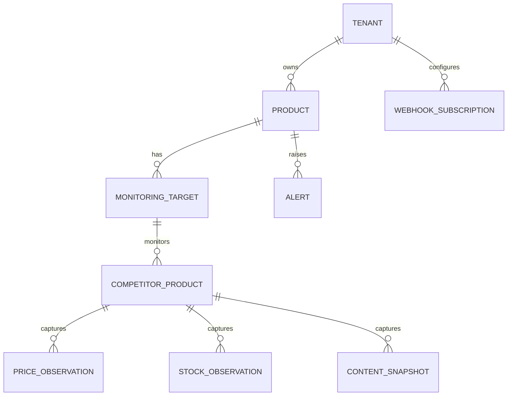

# Data Model

```mermaid
erDiagram
  TENANT ||--o{ PRODUCT : owns
  PRODUCT ||--o{ MONITORING_TARGET : has
  MONITORING_TARGET ||--o{ COMPETITOR_PRODUCT : monitors
  COMPETITOR_PRODUCT ||--o{ PRICE_OBSERVATION : captures
  COMPETITOR_PRODUCT ||--o{ STOCK_OBSERVATION : captures
  COMPETITOR_PRODUCT ||--o{ CONTENT_SNAPSHOT : captures
  PRODUCT ||--o{ ALERT : raises
  TENANT ||--o{ WEBHOOK_SUBSCRIPTION : configures
```

Time-series tables keep `captured_at` and are designed to be partition-friendly. Daily aggregates support dashboards without scanning raw observation history.
