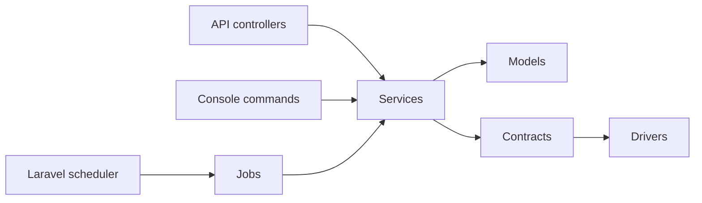

# Architecture Overview

The package is a Laravel-native library with controllers, models, jobs, services, and contracts.

Primary source folders:

- `src/Contracts` for extension points.
- `src/Services` for discovery, scraping, matching, pricing, AI, compliance, alerts, and webhooks.
- `src/Jobs` for queued workflows.
- `src/Http/Controllers/Api/V1` for public API endpoints.
- `database/migrations` for tenant-scoped persistence.
