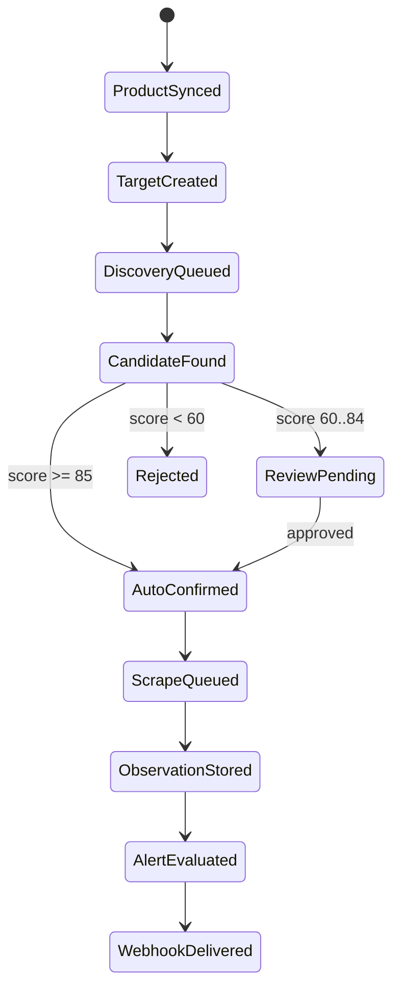

# Pipeline and Workflow

The scheduler selects due targets, dispatches scraping jobs, and updates `next_check_at` through adaptive backoff.

::: callout tip "Idempotency"
Jobs should be safe to retry. Persisted observations, match status, and fetch logs make repeated work detectable.
:::
