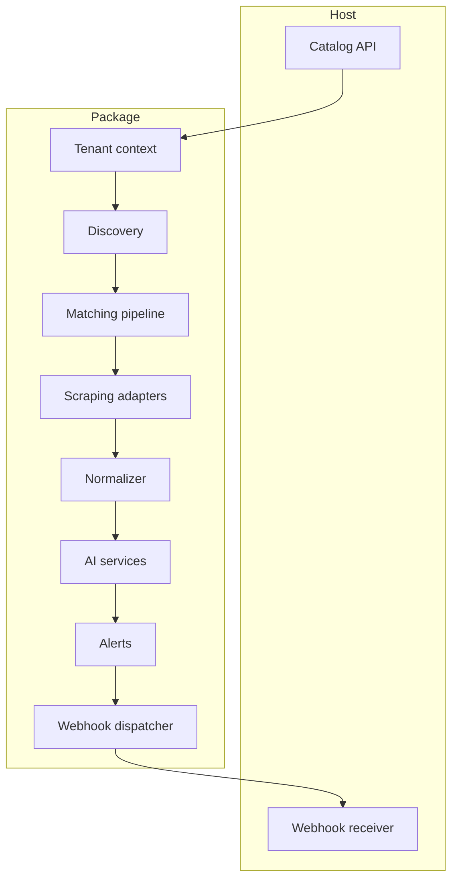

# Design

Il design separa input, acquisizione, normalizzazione, AI e delivery.

::: grids
::: grid
::: card "Interface first"
Drivers can be swapped by binding contracts.
:::
::: card "Queue first"
Discovery, scraping, AI, and notifications are idempotent jobs.
:::
::: card "Audit first"
Fetch logs, AI decision logs, and signed webhook attempts leave evidence.
:::
:::
:::
