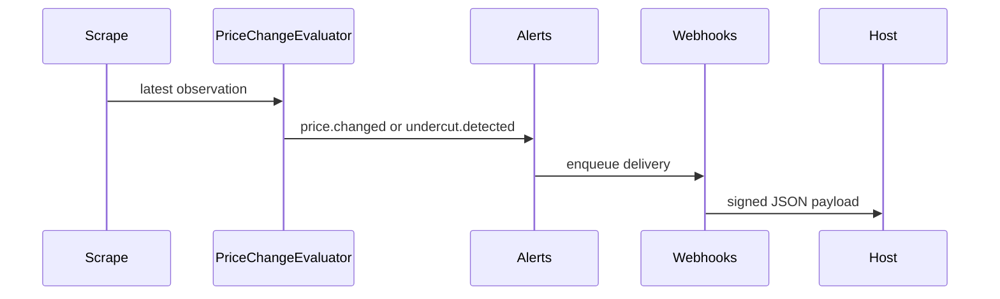

# Alerts and Webhooks

Alerts are persisted, then delivered through configured channels and outbound webhooks.

When a webhook subscription has a secret, deliveries include `X-PI-Signature: sha256=<hmac>`.

::: callout warning "Unsigned deliveries"
Unsigned webhooks are possible only when no secret is configured. Use a secret in production.
:::
