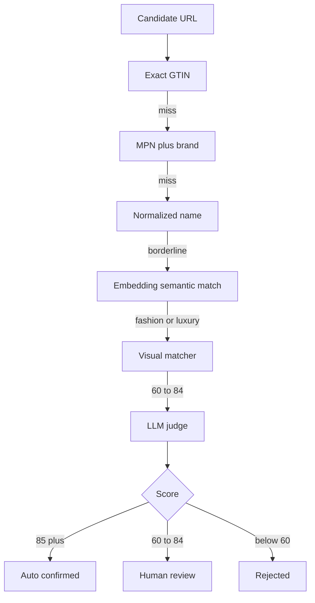

# Product Matching

Matching is a cascade. Cheap deterministic checks run first; LLM steps are reserved for borderline cases.

The acceptance bands are:

| Score | Result |
|---:|---|
| `85..100` | Confirmed |
| `60..84` | Match proposal |
| `0..59` | Rejected |

::: callout tip "Cost control"
The package caches embeddings and avoids re-running expensive AI steps unless candidate evidence changes materially.
:::
