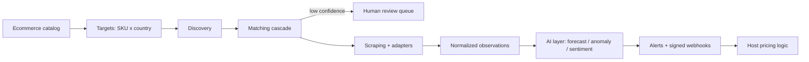

# laravel-ai-price-intelligence


[](https://packagist.org/packages/padosoft/laravel-ai-price-intelligence)


> **laravel-ai-price-intelligence is the competitor price & product intelligence engine `laravel/ai` is missing — self-hosted in your own stack.**
> Send it your SKUs and the countries to watch; it discovers competitor listings, matches the right
> product with an AI cascade, scrapes price/stock/content, normalizes multi-currency time-series, runs
> forecasts and anomaly detection, and emits signed webhooks — open-source, EU AI Act-ready, advisory
> by design. Your ecommerce keeps every pricing decision.

::: callout info "New here? Read this page top to bottom" icon:compass
In five minutes you'll know exactly what this package is, the problem it solves, why it beats every
black-box SaaS or DIY scraper alternative, and where to click next. Every other page goes deeper —
this one gives you the whole picture.
:::

---

## What it is — in one minute

Ecommerce teams pay expensive, black-box SaaS (Netrivals, Competitoor) to watch competitor prices,
assortments and content — renting back their own market data and never owning it. `laravel-ai-price-intelligence`
brings that capability **into your Laravel stack**, open-source and self-hostable.

You send the **SKUs**, the **countries** to watch, and either the **competitor URLs** or let the
**AI search** discover them. From there a single pipeline does the rest:

- **Match** the right competitor product — a cascade of GTIN → MPN → normalized name → embedding →
  optional vision LLM, each result carrying a confidence band with a human-review queue.
- **Scrape & normalize** — JSON-LD/OpenGraph extraction, generic HTTP + Browsershot and dedicated
  marketplace adapters (Amazon, eBay, Google Shopping, Farfetch, Idealo, Trovaprezzi), with
  multi-currency FX into one base currency and stored time-series.
- **Reason & notify** — forecasting, anomaly detection and GDPR-safe review sentiment, then
  **HMAC-signed webhooks + Laravel events** (price drop/raise, undercut, stock-out) your app reacts to.

> **In one line:** *the competitor-monitoring brick for Laravel — discover, match, scrape, forecast
> and alert on competitor prices at ~500k-SKU scale, from inside your own app, while you keep the
> pricing decisions.*

---

## The problem it solves

Every team running competitor monitoring hits the same wall: the data lives in someone else's SaaS,
the matching is a black box, and you pay per SKU to rent your own market intelligence. Here is the
gap this package closes.

| Without laravel-ai-price-intelligence | With laravel-ai-price-intelligence |
|---|---|
| You rent a black-box SaaS (Netrivals, Competitoor) and never own your market data. | A **self-hosted, Apache-2.0** engine runs in **your** Laravel app, on **your** DB — you own every row. |
| Product matching is opaque: you can't see *why* a competitor listing was paired with your SKU. | A transparent **matching cascade** (GTIN → MPN → name → embedding → vision LLM) with a **confidence band** and a human-review queue (auto ≥85 · review 60–84 · reject <60). |
| One scraper breaks on a marketplace and the whole run dies. | **Marketplace adapters** with API paths that **fall back to scraping** on any missing key or failure — a run never breaks. |
| Prices arrive in mixed currencies with no history. | **Multi-currency FX** normalization to a base currency and **time-series observations** for price, stock and promos. |
| "Insights" are static dashboards; no forecast, no anomaly signal. | Built-in **forecasting, anomaly/price-error detection** and GDPR-safe review sentiment, each flagged `is_ai_generated`. |
| Scraping 500k SKUs causes a thundering herd and OOM exports. | **Chunked jobs + adaptive backoff** on dedicated queues, **cursor pagination**, exact SQL facets and **streamed CSV export** — engineered for ≈500k SKUs. |
| Compliance is an afterthought — robots.txt, PII, AI disclosure all on you. | **EU AI Act-ready by design**: decision log, human-in-the-loop matching, robots.txt policy, PII redaction. |

---

## Who it's for

::: grids
  ::: grid
    ::: card "Ecommerce & retail" icon:shopping-cart
    Watch competitor prices, stock and assortment across countries, then feed signed webhooks into your dynamic pricing, MAP enforcement and merchandising — without handing your catalog to a SaaS.
    :::
  :::
  ::: grid
    ::: card "Marketplaces & brands" icon:store
    Track buy-box and listings on Amazon, eBay, Google Shopping, Farfetch, Idealo and Trovaprezzi with dedicated adapters, plus visual matching for catalogs where GTINs are missing.
    :::
  :::
  ::: grid
    ::: card "Pricing & category teams" icon:tags
    A match-review queue, price-history charts, forecasts, anomalies and a weekly AI narrative — the analyst cockpit Netrivals/Competitoor don't give you self-hosted.
    :::
  :::
  ::: grid
    ::: card "Platform & compliance engineering" icon:shield-check
    Multi-tenant (single-DB or DB-per-tenant), config-toggle everything, EU AI Act decision log and GDPR-safe pipelines — the governance layer to run competitor intelligence in-house.
    :::
  :::
:::

---

## Why it's different — the moats

Most tools either **rent** you competitor data or make you **build** a scraper. This package does
the whole pipeline, self-hosted, and goes further than anything in the Laravel ecosystem.

::: grids
  ::: grid
    ::: card "Transparent matching cascade" icon:git-merge
    GTIN → MPN → normalized name → embedding → optional **vision LLM**, every result carrying a confidence band. Auto-confirm ≥85, review 60–84, reject <60 — and you can see exactly which signal matched.
    :::
  :::
  ::: grid
    ::: card "Visual matching with vision LLMs" icon:eye
    When GTIN and MPN are missing, a vision-LLM match-judge compares product imagery — a moat neither Netrivals nor Competitoor offers.
    :::
  :::
  ::: grid
    ::: card "Marketplace adapters that never break" icon:plug
    Amazon (SP-API/Keepa), eBay (Browse API), Google Shopping (SerpApi), Farfetch (retailed/Apify) and generic JSON-LD — each defaults to scraping and **falls back to scraping** on any failure, so a run always completes.
    :::
  :::
  ::: grid
    ::: card "Engineered for ≈500k SKUs" icon:database
    Cursor pagination (OFFSET-free), exact SQL facets, streamed CSV export (OOM-safe), daily aggregates + partition-ready time-series, and chunked jobs with adaptive backoff on dedicated queues.
    :::
  :::
  ::: grid
    ::: card "AI signals, not just data" icon:brain
    Statistical forecasting (OLS trend + confidence interval), detrended-residual anomaly + price-error detection, narrative, content-gap and promo analysis — pluggable and toggleable per feature.
    :::
  :::
  ::: grid
    ::: card "EU AI Act-ready by design" icon:scale
    Native disclosure (`is_ai_generated`), an Art. 12 decision log, human-in-the-loop matching, plus an optional bridge to `padosoft/laravel-ai-act-compliance`.
    :::
  :::
  ::: grid
    ::: card "Boundary-respecting & advisory" icon:git-branch
    It is the *intelligence engine*: it emits signals via HMAC-signed webhooks and events. The optional repricer is off by default and advisory-only — your ecommerce keeps every pricing decision.
    :::
  :::
  ::: grid
    ::: card "Pluggable everywhere, sovereign-ready" icon:puzzle
    Every stage is an Interface + Driver with null-object optional deps. Run the deterministic `fake` LLM/embeddings with zero keys, or switch to `laravel/ai` — including the EU-sovereign `regolo` provider.
    :::
  :::
  ::: grid
    ::: card "Open-source, self-hosted, you own it" icon:lock
    Apache-2.0, runs in your Laravel app and your DB. No per-SKU SaaS bill, no black box, no vendor lock-in.
    :::
  :::
:::

---

## See it: the intelligence cockpit

A companion **web admin panel** ships separately as
[`padosoft/laravel-ai-price-intelligence-admin`](https://github.com/padosoft/laravel-ai-price-intelligence-admin)
— a React 19 + Vite + TypeScript + Tailwind console driving every endpoint: dashboards, the
match-review queue, price-history charts, forecasts and anomalies, the weekly AI narrative,
assortment/content gaps, the repricer rule builder, alerts inbox, webhooks and an EU AI Act
compliance view. It consumes this package's API directly — no mocks.


---

## laravel-ai-price-intelligence vs. the alternatives

| Capability | **laravel-ai-price-intelligence** | Manual monitoring | SaaS price trackers (Netrivals / Competitoor) | DIY scrapers |
|---|:---:|:---:|:---:|:---:|
| Price/stock across multiple countries | ✅ | ➖ | ✅ | ➖ |
| Transparent AI matching cascade + confidence | ✅ | ❌ | ➖ | ❌ |
| Visual matching (vision LLM) | ✅ | ❌ | ❌ | ❌ |
| Marketplace adapters with scrape fallback | ✅ | ❌ | ➖ | ➖ |
| Price forecasting + anomaly detection | ✅ | ❌ | ❌ | ❌ |
| Engineered for ≈500k SKUs (cursor/facets/stream) | ✅ | ❌ | ➖ | ➖ |
| EU AI Act-ready by design | ✅ | ➖ | ❌ | ❌ |
| Self-hosted — you own the data | ✅ | ✅ | ❌ | ✅ |

> Legend: ✅ built-in · ➖ partial / extra cost / manual · ❌ not available.

---

## How it fits together

Your ecommerce sends a catalog and targets; the package discovers, matches, scrapes and normalizes
into a time-series, runs the AI layer, and emits signed webhooks your app reacts to.



The package is boundary-respecting: it produces intelligence, while the host application keeps the
final pricing, margin, order, checkout and inventory decisions.

---

## Start in 30 seconds

::: steps
1. **Install the package**
   ```bash
   composer require padosoft/laravel-ai-price-intelligence
   php artisan vendor:publish --tag=price-intelligence-config   # optional
   php artisan migrate
   ```
   The default LLM/embeddings driver is `fake` — deterministic and offline — so the package works out
   of the box with no API keys and CI never makes a live call.

2. **Issue an API key and sync your catalog**
   ```php
   use Padosoft\PriceIntelligence\Models\ApiKey;

   [$key, $plaintext] = ApiKey::issue($tenantId, 'ecommerce-sync', ['*']);
   // store $plaintext securely — it is shown only once

   Http::withHeaders(['X-Api-Key' => $plaintext])->post("$base/api/v1/catalog/products:bulk", [
       'products' => [[
           'external_id' => 'SKU-123', 'gtin' => '8001234567890',
           'brand' => 'Acme', 'model' => 'X1', 'name' => 'Acme X1 64GB',
           'our_price_cents' => 19900, 'currency' => 'EUR', 'base_country' => 'IT',
       ]],
   ]);
   ```

3. **Create a target and react to signals**
   ```php
   Http::withHeaders(['X-Api-Key' => $plaintext])->post("$base/api/v1/targets", [
       'product_external_id' => 'SKU-123', 'country' => 'IT', 'frequency' => 'daily',
   ]);

   // Signed webhook listener in your app
   use Padosoft\PriceIntelligence\Services\Webhooks\WebhookSigner;

   Route::post('/webhooks/price-intel', function (Request $r) {
       abort_unless(WebhookSigner::verify(
           $r->getContent(), config('services.pi.secret'), $r->header(WebhookSigner::HEADER, '')
       ), 401);

       match ($r->input('event')) {
           'price.dropped', 'undercut.detected' => MarginOS::reevaluate($r->input('data')),
           default => null,
       };
   });
   ```
:::

**[→ Quickstart](/get-started/quickstart)** · **[→ Installation](/get-started/installation)** · **[→ Integrating an Ecommerce](/guides/integrating-ecommerce)**

---

## Batteries included for AI-assisted development

This repo ships **AI batteries** — a `CLAUDE.md` working guide, an `AGENTS.md` workflow contract and
invocable `.claude/skills/` encoding the TDD loop, the docmd docs-sync discipline and the
LESSON/PROGRESS logging rules. Open the package in Claude Code, Cursor, Copilot or Codex and your
agent already knows the house rules.

---

## Where to go next

::: grids
  ::: grid
    ::: card "Quickstart" icon:zap
    Install, sync a catalog and create your first monitoring target in minutes. **[Open →](/get-started/quickstart)**
    :::
  :::
  ::: grid
    ::: card "Product Matching" icon:git-merge
    The matching cascade, confidence bands and the human-review queue, explained. **[Read →](/guides/product-matching)**
    :::
  :::
  ::: grid
    ::: card "Scaling Large Catalogs" icon:database
    Cursor pagination, exact facets, streamed export and daily aggregates for ≈500k SKUs. **[Explore →](/best-practices/scaling-large-catalogs)**
    :::
  :::
:::

::: callout tip "Package facts" icon:info
Composer `padosoft/laravel-ai-price-intelligence` · PHP `^8.3` · Laravel `11 | 12 | 13` ·
LLM via the official `laravel/ai` SDK (deterministic `fake` default) · Apache-2.0 ·
[GitHub](https://github.com/padosoft/laravel-ai-price-intelligence) · [Packagist](https://packagist.org/packages/padosoft/laravel-ai-price-intelligence)
:::
